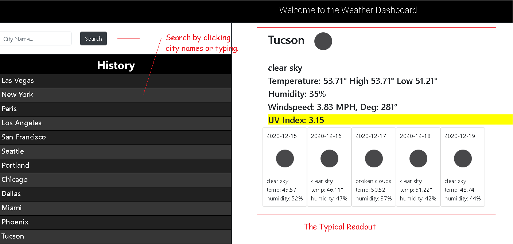

# node_Weatherdashboard

### The app can be sampled <a href= "https://agile-retreat-46101.herokuapp.com/">here</a>

###### Hello, thanks for checking out my rendition of the Weather Dashboard. This version uses Express-Handlebars and hides the API key. Feel free to use it as a reference or to build apon it. Also if you feel inclined to suggest improvements to my code I'm always open to suggestions. 

###### I utilized the Open Weather API - https://openweathermap.org/ to generate a Current Weather along with UV Index. The site also displays a five day forecast with UV index forecast.

#### Technologies Used.
1. Node.js
1. Express Server
1. Handlebars.js
1. Bootstrap
1. HTML,CSS and Javascript.

### API key configuration.
###### If youw will be using this with your own API key you will have to get one issued to you via the openweathermap.org by creating an account. Once you have done that you will have to create a .env file inside of it simply create the OWK = <yourkey> variable 

